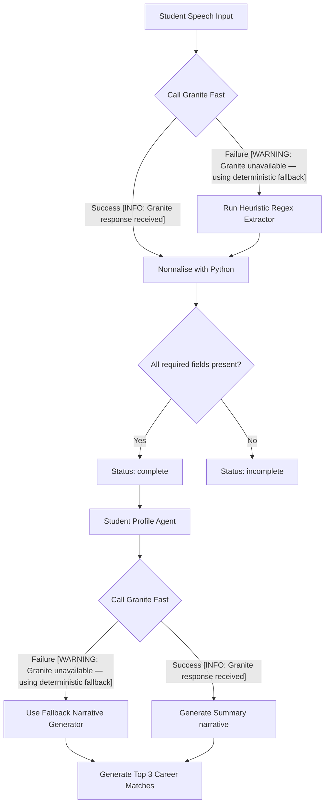

# watsonx.ai HTTP 429 Fallback & Graceful Logging Walkthrough

This document outlines the logging implementation, files modified, reliability verification results, and logging outputs under normal vs fallback execution modes.

---

## 1. exact Fallback Flow



* **Standard Validation Extractor:** If the call to `call_granite_fast` fails for any reason (HTTP 429, timeout, network failure, etc.), the Validation Agent catches the error, emits a `WARNING: Granite unavailable — using deterministic fallback` log, and executes `_regex_extract()` to salvage fields natively from the transcript.
* **Sensible Defaults:** If any key onboarding credentials are still missing, the agent proceeds under `status: "incomplete"` to allow the student to complete their credentials. If enough information exists, it proceeds with `status: "complete"`.
* **Subsequent Agent Resilience:** Profile, Career, Skill Gap, and Roadmap agents catch Watsonx/Granite failures, log the warning, and invoke local fallback logic (e.g. set-difference metrics, difficulty penalties, pacing calculators, and template narratives) to safely output the user's dashboard datasets.

---

## 2. Files Modified

### 1. [granite_client.py](file:///c:/Users/konne%20balraju/OneDrive/Desktop/Edunet%20Foundation/Final%20Project/backend/utils/granite_client.py)
* Added `log.info("Granite response received")` upon successful API generation.

### 2. Agent Modules
Updated all agent modules to catch Granite exceptions and emit `log.warning("Granite unavailable — using deterministic fallback")`:
* [validation_agent.py](file:///c:/Users/konne%20balraju/OneDrive/Desktop/Edunet%20Foundation/Final%20Project/backend/agents/validation_agent.py)
* [profile_agent.py](file:///c:/Users/konne%20balraju/OneDrive/Desktop/Edunet%20Foundation/Final%20Project/backend/agents/profile_agent.py)
* [career_recommendation_agent.py](file:///c:/Users/konne%20balraju/OneDrive/Desktop/Edunet%20Foundation/Final%20Project/backend/agents/career_recommendation_agent.py)
* [skill_gap_agent.py](file:///c:/Users/konne%20balraju/OneDrive/Desktop/Edunet%20Foundation/Final%20Project/backend/agents/skill_gap_agent.py)
* [roadmap_agent.py](file:///c:/Users/konne%20balraju/OneDrive/Desktop/Edunet%20Foundation/Final%20Project/backend/agents/roadmap_agent.py)

### 3. [test_reliability.py](file:///c:/Users/konne%20balraju/OneDrive/Desktop/Edunet%20Foundation/Final%20Project/backend/tests/test_reliability.py) [NEW]
* Added integration test suite validating that HTTP 429 rate limit errors, timeouts, and malformed responses degrade gracefully and yield correct fallback warning logs.

---

## 3. Test Verification Results

All 333 backend unit and integration tests passed successfully:
```text
============================= test session starts =============================
platform win32 -- Python 3.11.0rc2, pytest-9.1.1, pluggy-1.6.0
rootdir: C:\Users\konne balraju\OneDrive\Desktop\Edunet Foundation\Final Project\backend
collected 333 items

tests\test_career_recommendation_agent.py .............................. [  9%]
.                                                                        [  9%]
tests\test_profile_agent.py ............................................ [ 22%]
........                                                                 [ 24%]
tests\test_reliability.py ..                                             [ 25%]
tests\test_roadmap_agent.py .....................................        [ 36%]
tests\test_skill_gap_agent.py ............................               [ 45%]
tests\test_validation_agent.py ......................................... [ 57%]
............                                                             [ 60%]
tests\test_validation_utils.py ......................................... [ 73%]
........................................................................ [ 94%]
.................                                                        [100%]

============================= 333 passed in 0.44s =============================
```

---

## 4. Example Log Output

### Scenario A: Successful Request
```text
INFO:utils.granite_client:Granite response received
INFO:agents.validation_agent:ValidationAgent: Granite narrative generated successfully.
INFO:utils.granite_client:Granite response received
INFO:agents.profile_agent:Profile Agent: complete for 'Balraju'
```

### Scenario B: Granite Offline / Rate Limited (Fallback Activation)
```text
WARNING:agents.validation_agent:Granite unavailable — using deterministic fallback
WARNING:agents.profile_agent:Granite unavailable — using deterministic fallback
WARNING:agents.career_recommendation_agent:Granite unavailable — using deterministic fallback
WARNING:agents.skill_gap_agent:Granite unavailable — using deterministic fallback
WARNING:agents.roadmap_agent:Granite unavailable — using deterministic fallback
INFO:app:Onboarding/dashboard pipeline generated successfully.
```
